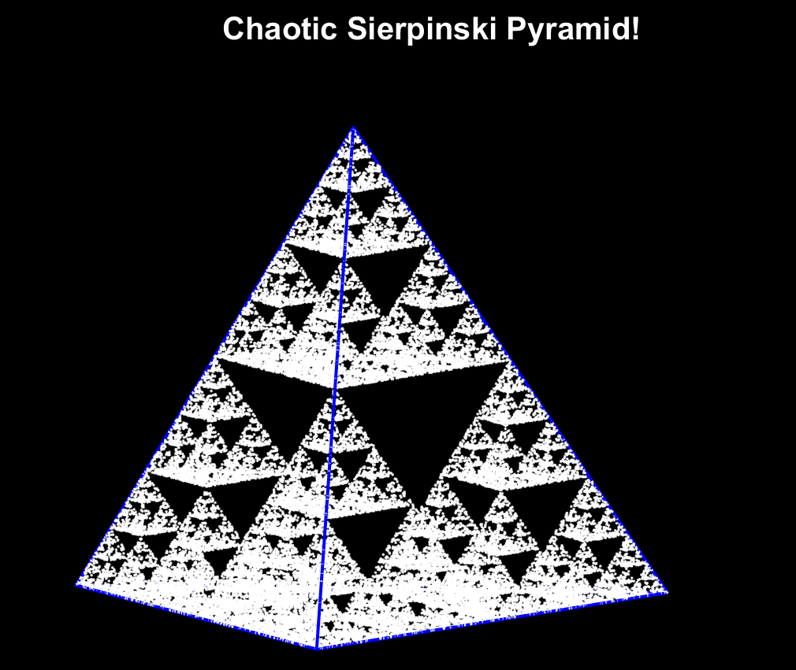
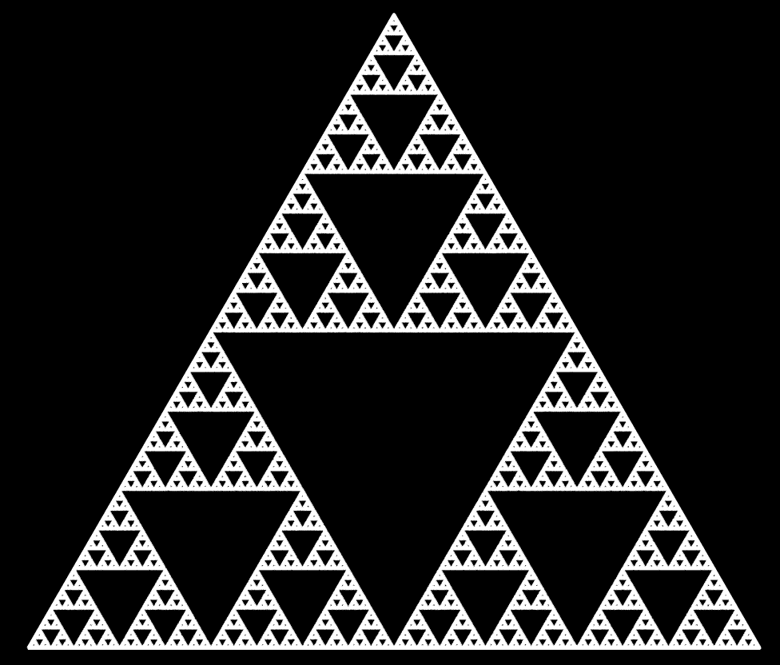
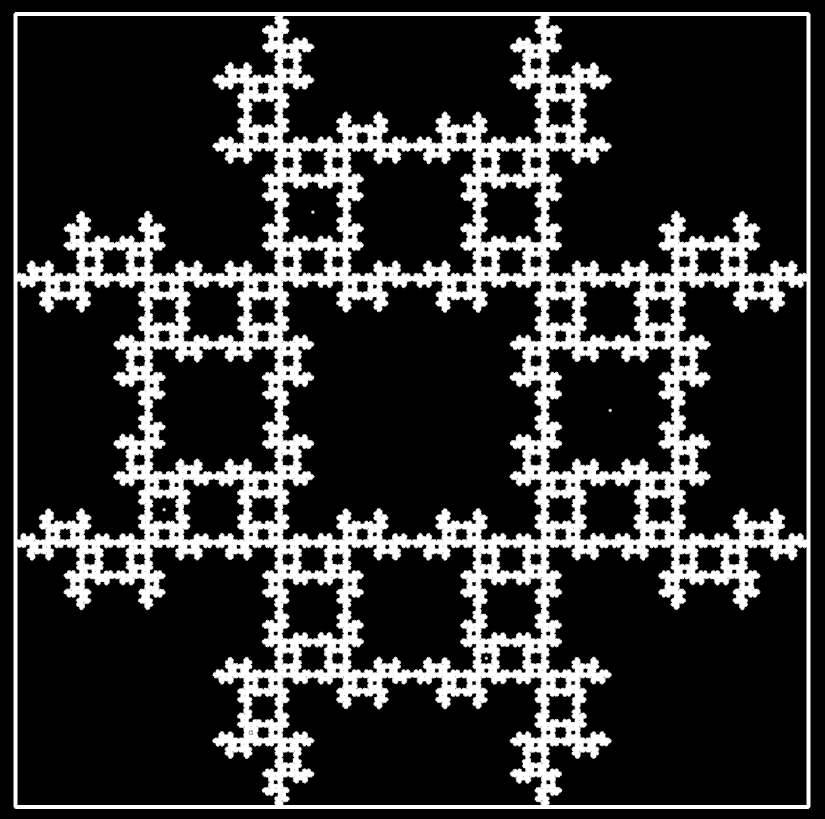
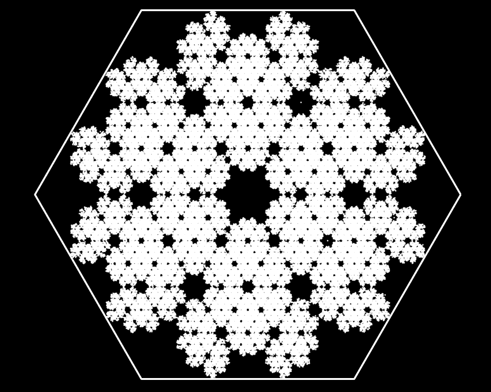
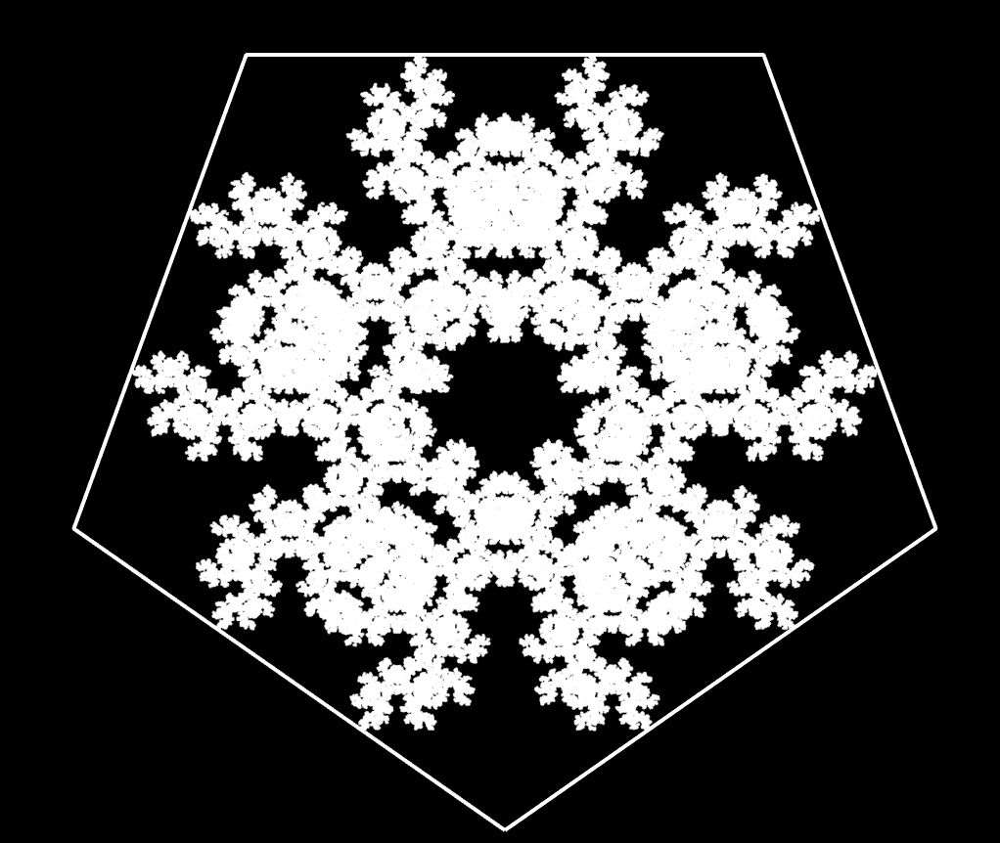
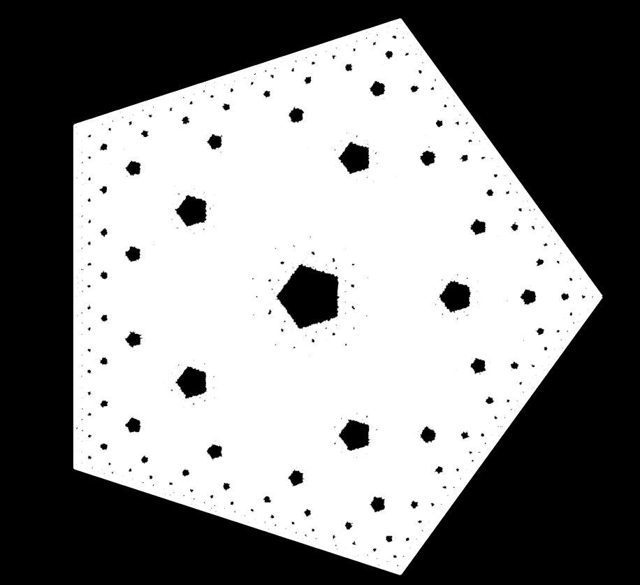

# Random Dot Madness

### ***As Engineers "WE" have the Duty of Finding Order in Chaos!***

Using Random Dots is a way of making wonderfull fractals. Like Sierpinski Triangle, Carpet, Pentagon and Pyramid!

##### ***All Created with Randomly Created Dots!***

>Starting From SierPinski Pyramid!

>SierPinski Triangle!

>SierPinski Carpet!

>HexaGon!

>PentaGon!

>Another Pentagon!
